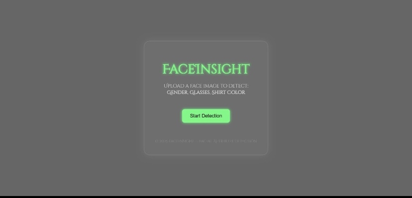
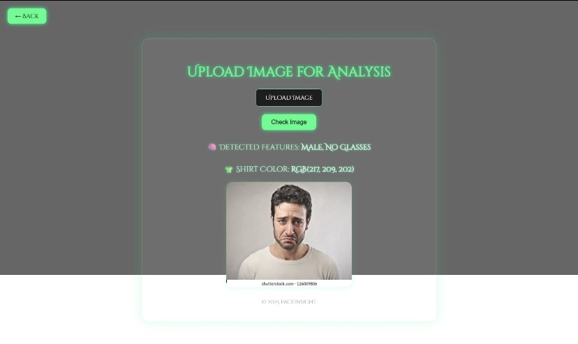

# 🧠 FaceInsight – AI-Powered Facial Feature Detector

FaceInsight is a **web-based AI application** that analyzes facial images to predict **gender**, **glasses presence**, and **shirt color** using **deep learning and computer vision techniques**.  
It delivers fast and accurate results through an intuitive and modern web interface.

---

## 🎯 Features

- 🔍 **Gender Detection** using CNN  
- 👓 **Glasses Detection** using CNN  
- 👕 **Shirt Color Detection** using KMeans Clustering  
- 📤 Image upload with **real-time preview**  
- ⚡ Fast predictions with clean UI  
- 🛡️ Error handling for invalid inputs  

---

## 🖼️ Visuals

### Home Page
📸 Minimalist landing page with navigation to the image detection module  

### Upload Page
📸 Upload image, view preview, and get predictions for gender, glasses, and shirt color  

### Result Page
📸 Displays clear detection results with uploaded image  

---

## 🧠 Tech Stack

- **Backend:** Django  
- **Deep Learning:** TensorFlow / Keras (CNN)  
- **Computer Vision:** OpenCV  
- **Clustering:** KMeans  
- **Frontend:** HTML, CSS (Responsive UI)  
- **Language:** Python  

---

## 🏗️ Model Details

- Two **CNN models** trained for:
  - Gender Classification  
  - Glasses Detection  
- Image preprocessing includes:
  - Resizing  
  - Normalization  
- Shirt color extracted by:
  - Cropping shirt region  
  - Applying **KMeans clustering**

---

## 📊 Learning Outcomes

- Trained and fine-tuned **CNN models** for binary classification  
- Integrated ML models into a **Django web application**  
- Implemented image preprocessing and color extraction  
- Improved understanding of **ML deployment challenges**  
- Strengthened frontend–backend coordination skills  

---

## 🚀 Future Improvements

- 🎥 Real-time webcam-based detection  
- 📈 Larger and more diverse dataset  
- 😊 Add age & emotion detection  
- ☁️ Deploy as a cloud-based API  

---

## 🤖 About

This project is built to demonstrate the **real-world application of AI and Computer Vision** in image analysis and web-based systems.

